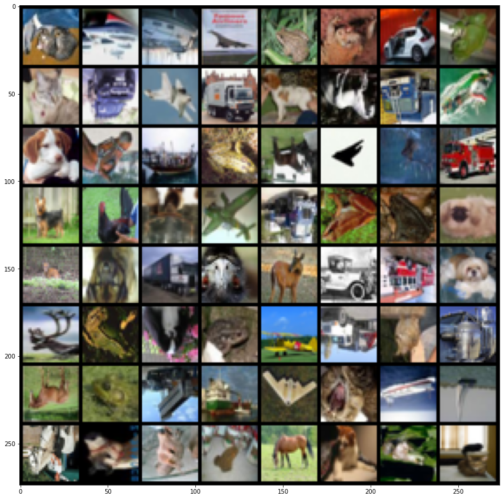
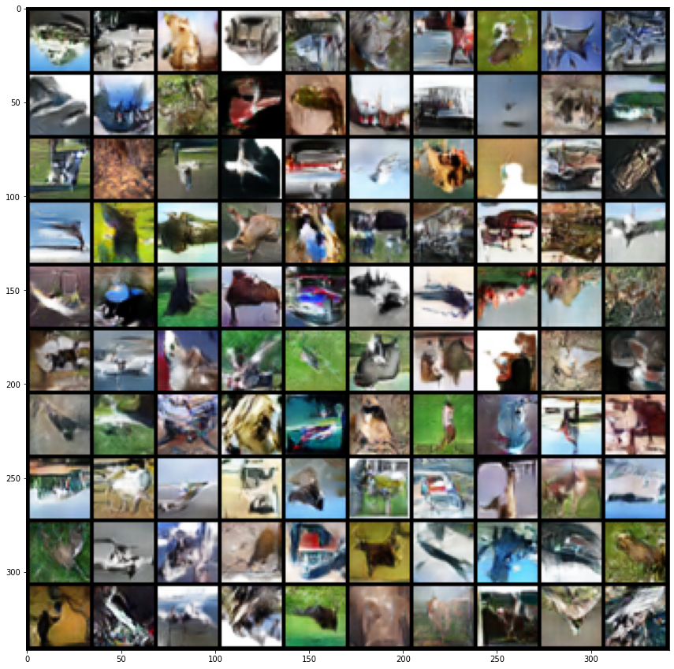

# Generative AI

Implementing and optimizing two generative models from scratch for image generation (ICL):
1. Variational Auto Encoder (VAE)
2. Deep Convolutional Generatve Adversarial Network (DCGAN) 

## Variational Auto Encoder (VAE)

On MNIST dataset.

### Reconstructed images

### Generated images

## Deep Convolutional Generatve Adversarial Network (DCGAN)

On CIFAR10 dataset

### Original images

### Generated images

#### Methods

- DCGAN architecture adapted to the 32x32 size of the images
- Gradient penalty term for discriminator
- 5% of labels are flipped
- One-sided label smooting (Real labels set to 0.9 for stronger gradient signals)
- Batch normalization
- Data augmentation
- Learning rate scheduling
- Leaky ReLU in the discriminator (from literature: _Radford et al. Unsupervised Representation Learning with Deep Convolutional Generative Adversarial Networks_)
